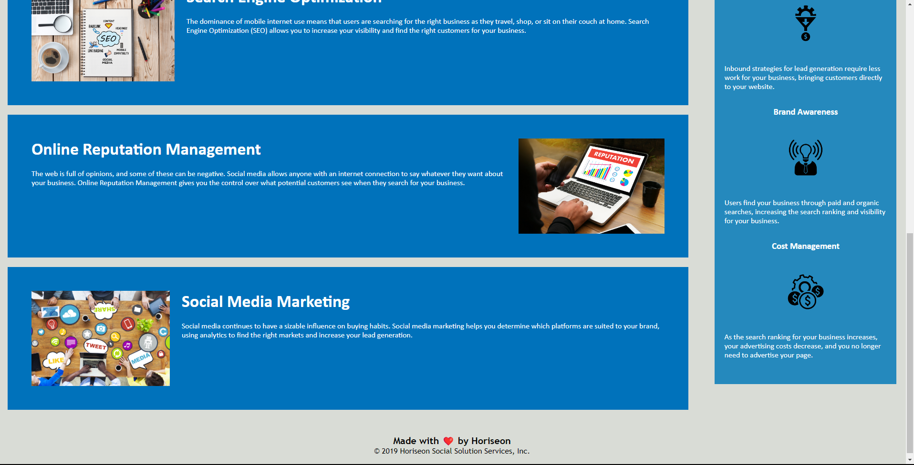

# Challenge #1 
Horiseon website 
## HTML 
The index.html sets the basic frame work of the whole website. providing the text, pictures and overall struckture of the website and the information that it contains

## Horiseon HTML Symantic Elements
In this portion of the challenge I Went in and changed the div symantic eliments. 

## CSS
made sure the css elements/ ids are the same as well so that they display the same and the positioning of every section from header to Footer are properly proportioned to the specs from the original website that was provided.

## Screenshot 

## links to the website
<li>https://alexwatabe9.github.io/Challenge1/</li>
<li>https://github.com/AlexWatabe9/Challenge1</li>
